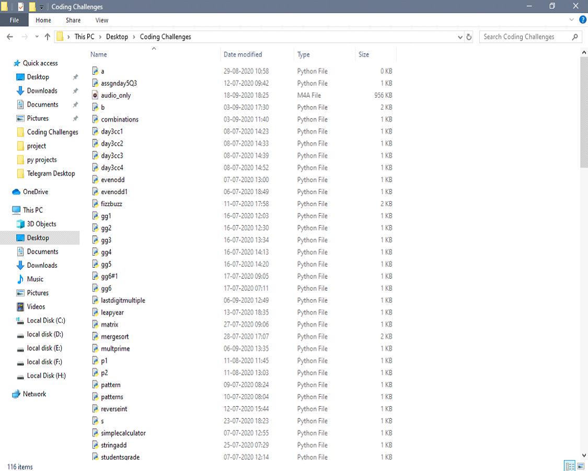
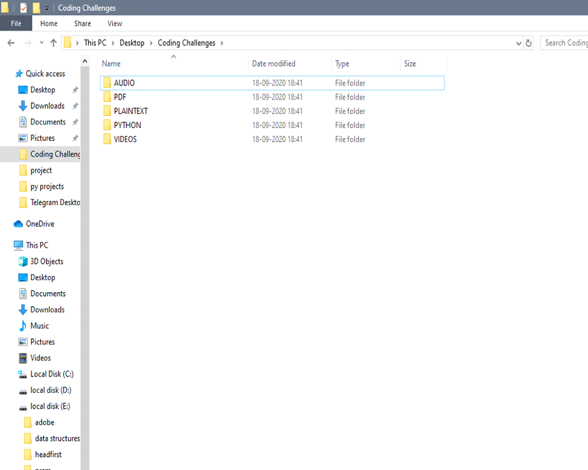

Junk file organizer using python

python script to arrange junk files in a directory by file type.
copy fileorganizer.py to the folder where you want to organize and double click to organize all files.

Before organizing files

After organizing files

 